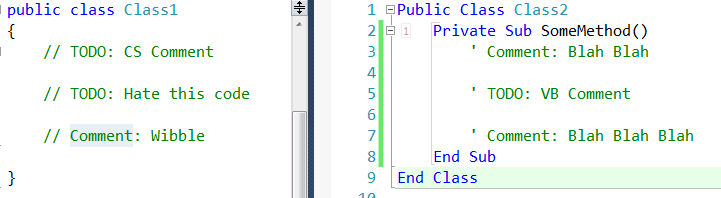

Todo Tabber for CodeRush
=============
This plugin extends the Tab-to-Next-Reference feature of [CodeRush](http://devexpress.com/coderush) so that one may Tab through all comments which match a given pattern.

The starting pattern may be one of:

  * // TODO: 
  * // BUG:
  * // FIXME: 

In fact, 'ToDo Tabber' requires only that your comment contains a **':'** character.

This being the case it will scan all characters up to that point, and then find all other comments in your solution which start in the same way and mark these for navigation, allowing you to tab through them to your hearts content.

Usage
===

Place your caret within the comment and press either Tab or Shift+Tab

